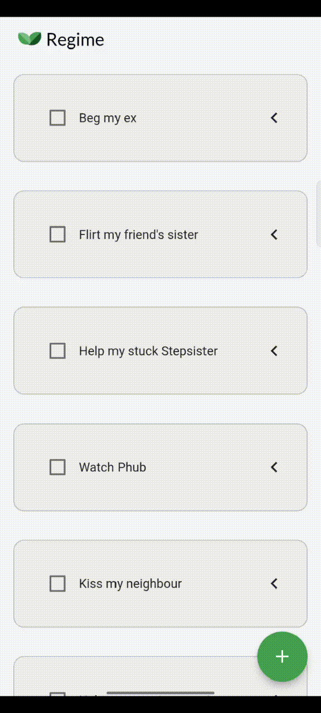

# Flutter FAB Visibility

A new Flutter package that hides the Floating action button when Up Scrolled, and visible when Down Scrolled.

## Features

[*] Compatible on Android and iOS.

### Show some :heart: and star the repo to support the project

### Screenshots



### Usage

[Example](https://github.com/darshn-n/flutter_fab_visibility/blob/master/example/example_app.dart)

### Created & Maintained By

[Darshan N](https://github.com/darshn-n)

> If you found this project helpful or you learned something from the source code and want to thank me <darshan51081@gmail.com>

# License

    Copyright 2022 Darshan N

    Licensed under the Apache License, Version 2.0 (the "License");
    you may not use this file except in compliance with the License.
    You may obtain a copy of the License at


    Unless required by applicable law or agreed to in writing, software
    distributed under the License is distributed on an "AS IS" BASIS,
    WITHOUT WARRANTIES OR CONDITIONS OF ANY KIND, either express or implied.
    See the License for the specific language governing permissions and
    limitations under the License.

## Getting started

For help getting started with Flutter, view our online
[documentation](https://flutter.dev/).

## Usage

- To add the following dependency to your [pubspec.yaml](https://github.com/darshn-n/flutter_fab_visibility)

```yaml
  flutter_fab_visibility: Latest Version
```

```dart
       VisibleFAB(
        onPressed: (){
            Navigator.pop(context)
        }
        child: Icon(
            Icons.add,
            ),
       )
```

## Additional information

This package is Light-weight with every properties of Floating Action Button.
